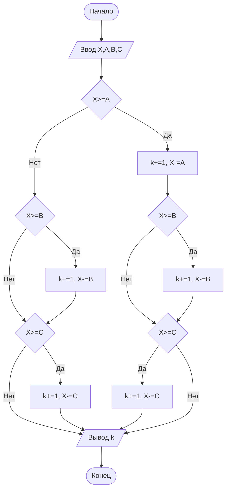

```mermaid
flowchart TD
    A([Начало]) --> B[/Ввод Х,А,В,С/];
    B --> C{X>=A};
    C--Да--> D[k+=1, X-=A];
    C--Нет--> E{X>=B};
    D--> F{X>=B};
    E--Да--> G[k+=1, X-=B];
    E--Нет--> H{X>=C};
    H--Да--> K[k+=1, X-=C];
    G--> H;
    F--Да--> M[k+=1, X-=B];
    F--Нет--> N{X>=C};
    H--Нет-->P;
    K-->P[/Вывод k/];
    P--> R([Конец]);
    N--Да-->S[k+=1, X-=C];
    S-->P;
    M-->N;
    N--Нет-->P;
```
   
   
    
    

